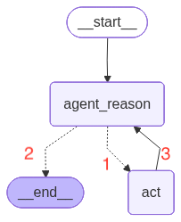
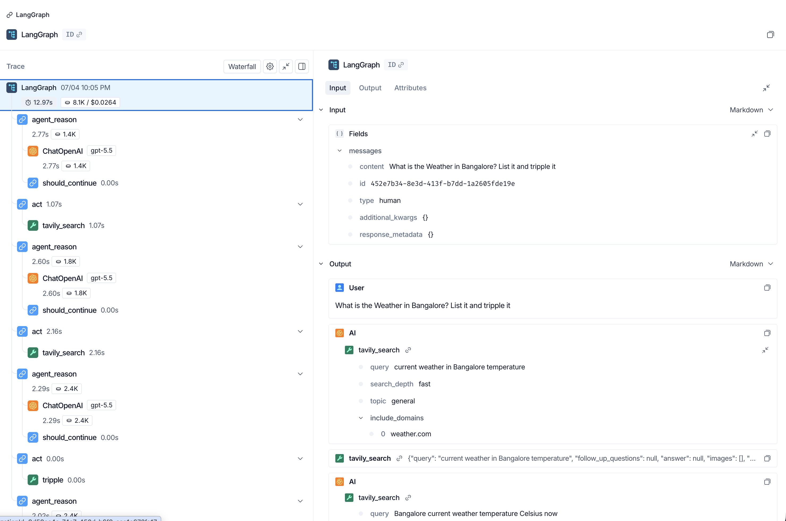
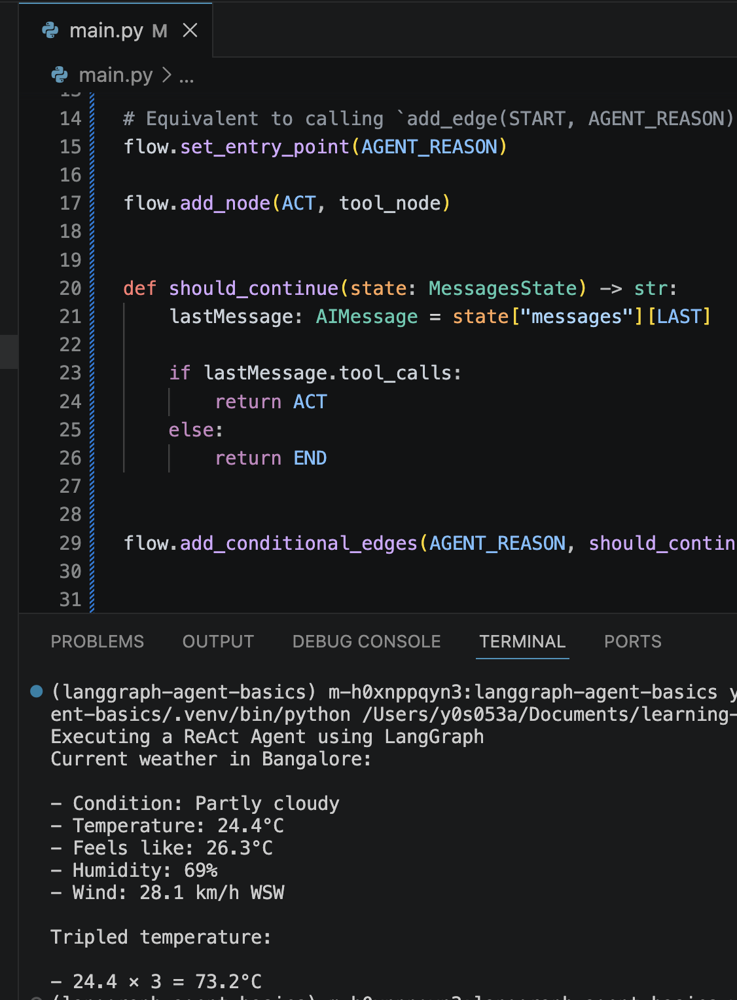

## LangGraph-agent-basics
Implementing ReAct Agent using LangGraph. <br>
ReAct Agent - A ReAct agent executes tool calls in a loop until it determines the final answer.  <br>


## Agent that is built <br>
<br>
### Agent  has access to the following tools <br>
1- Web Search tool [TavilySearch] <br>
2- tool function to tripple a floating number.<br>

### Nodes: <br>
agent_reason - LLM invocation with tools <br>
act - Takes the tool invocation requested by model and exectues <br>
### Edges  <br>
[Edge numbers in the flow Diagram] <br>
1- When model response requested tool execution <br>
2- when model response did not request execution [Answer found]<br>
3- Feed the response of the tool Execution  back to model in its next request<br>

## Setup
Install dependencies using uv:


```
uv add black isort langchain langchain-openai langchain_tavily langgraph python-dotenv
```

## LangGraph Components
nodes - nodes.py <br>
graph Defination - main.py

LangSmith Trace - <br>
https://smith.langchain.com/public/1d502442-90e5-4422-b7a9-8d16876362b8/r/019f2dfc-a3e8-7c41-85cc-cbabf5e48bb8
<br>


Execution:

